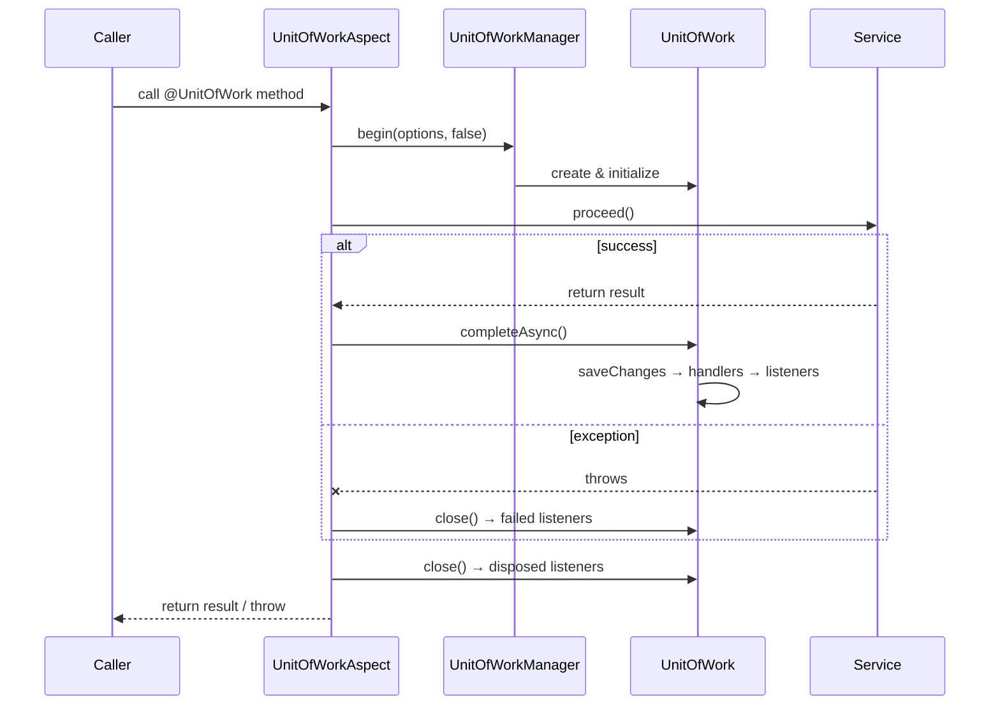

# Unit of Work Module

A lightweight, async unit-of-work abstraction for coordinating transactional resources (database, message broker, etc.) in a single atomic operation. Inspired by the .NET `Euonia.Uow` module.

---

## Architecture

```
UnitOfWorkManager
        │
        ├── begin(options, requiresNew)
        │       │
        │       ▼
        │   ┌─────────────────────┐
        │   │    UnitOfWork        │
        │   │  (implements        │
        │   │   AutoCloseable)    │
        │   └────────┬────────────┘
        │            │
        │            ├── contexts: Map<String, UnitOfWorkContext>
        │            │       ├── "db"     → JdbcTransactionContext
        │            │       ├── "mq"     → MessageQueueContext
        │            │       └── "cache"  → CacheContext
        │            │
        │            ├── listeners
        │            │       ├── completedListeners
        │            │       ├── failedListeners
        │            │       └── disposedListeners
        │            │
        │            └── handlers
        │                    └── completedHandlers (async pre-completion)
        │
        └── getCurrent() → UnitOfWorkAccessor (ThreadLocal)
```

## Core Concepts

| Class / Interface | Description |
|-------------------|-------------|
| `UnitOfWork` | Coordinates contexts, listeners, and lifecycle (save → complete → dispose) |
| `UnitOfWorkManager` | Entry point — creates units, manages ambient scope via `ThreadLocal` |
| `UnitOfWorkContext` | Interface for transactional resources (save, commit, rollback, close) |
| `ChildUnitOfWork` | Delegates to parent when nesting without `requiresNew` |
| `UnitOfWorkAccessor` | `ThreadLocal` holder for the current ambient unit of work |
| `UnitOfWorkOptions` | Transactional flag, isolation level, timeout |
| `UnitOfWorkEnabled` | Marker interface for automatic interception |
| `@UnitOfWork` | Annotation for declarative unit-of-work boundaries |
| `UnitOfWorkHelper` | Static utilities for introspecting annotations |

## Lifecycle

```
initialize(options)
        │
        ▼
   [add contexts & business logic]
        │
        ├── completeAsync()
        │       │
        │       ├── saveChangesAsync()  ← flush all contexts
        │       ├── invokeCompletedHandlers()
        │       └── notifyCompleted()   ← fire completed listeners
        │
        └── close()  (AutoCloseable / try-with-resources)
                │
                ├── close all contexts
                ├── notifyFailed() if !completed
                └── notifyDisposed()
```

## Quick Start

### Programmatic API

```java
UnitOfWorkManager manager = new UnitOfWorkManager();

try (UnitOfWork uow = manager.begin(new UnitOfWorkOptions(true), false)) {
    uow.addContext("db", new JdbcTransactionContext(connection));

    uow.addCompletedListener(event ->
        log.info("Unit of work {} completed", event.getUnitOfWork().getId()));

    uow.addFailedListener(event ->
        log.error("Unit of work failed", event.getException()));

    // ... business logic ...

    uow.completeAsync().toCompletableFuture().join();
}
```

### Annotation-driven (with AOP)

Add the `@UnitOfWork` annotation to your service classes or methods:

```java
import com.euonia.uow.annotation.UnitOfWork;

@UnitOfWork
public class OrderService implements UnitOfWorkEnabled {

    public void placeOrder(Order order) {
        // Automatically wrapped in a unit of work
    }

    @UnitOfWork(disabled = true)
    public List<Order> findOrders() {
        // Read-only — no unit of work
    }
}
```

### Spring Boot Integration

Add the `spring` module dependency:

```xml
<dependency>
    <groupId>com.euonia</groupId>
    <artifactId>spring</artifactId>
    <version>${euonia.version}</version>
</dependency>
```

The auto-configuration (`UnitOfWorkAutoConfiguration`) registers:
- `UnitOfWorkAccessor` — thread-local holder
- `UnitOfWorkManager` — entry point for creating units of work
- `UnitOfWorkAspect` — AOP aspect wrapping `@UnitOfWork`-annotated methods

**How the aspect works:**



**Service example:**

```java
@Service
@UnitOfWork
public class OrderService {

    private final JdbcTemplate jdbc;
    private final RabbitTemplate rabbit;

    public OrderService(JdbcTemplate jdbc, RabbitTemplate rabbit) {
        this.jdbc = jdbc;
        this.rabbit = rabbit;
    }

    public void placeOrder(Order order) {
        // DB insert and MQ publish happen in the same unit of work
        jdbc.update("INSERT INTO orders ...");
        rabbit.convertAndSend("order.exchange", "placed", order);
        // On success: both are committed
        // On failure: both are rolled back
    }
}
```

**Registering transactional contexts:**

Use lifecycle listeners to register your contexts automatically:

```java
@Configuration
public class UowContextConfig {

    @Bean
    public UnitOfWorkManager unitOfWorkManager(
            UnitOfWorkAccessor accessor,
            DataSource dataSource,
            ConnectionFactory connectionFactory) {

        UnitOfWorkManager manager = new UnitOfWorkManager(accessor, new UnitOfWorkOptions(true));

        // Register a global listener to add contexts on creation
        // (fired via UnitOfWork.addDisposedListener approach, or
        //  subclass UnitOfWorkManager to override begin())
        return manager;
    }
}
```

For programmatic context registration per unit of work:

```java
@Autowired
private UnitOfWorkAccessor accessor;

public void doSomething() {
    UnitOfWork uow = accessor.getCurrentUnitOfWork();
    uow.getOrAddContext("db", () -> new JdbcTransactionContext(dataSource.getConnection()));
    // ... all DB operations share this context ...
}
```

**Nested units of work:**

```java
@Service
public class OrderFacade {

    @Autowired
    private UnitOfWorkManager manager;

    @UnitOfWork
    public void checkout(Order order) {
        // Outer unit of work begins automatically
        paymentService.charge(order);    // participates in outer UOW
        inventoryService.reserve(order); // participates in outer UOW
    }
}

@Service
@UnitOfWork
public class PaymentService {
    // Methods automatically join the ambient unit of work
    // unless .begin(..., true) is used for a new transaction
}
```

### Custom Transactional Context

```java
public class JdbcTransactionContext implements UnitOfWorkContext {
    private final Connection connection;

    public JdbcTransactionContext(Connection connection) {
        this.connection = connection;
    }

    @Override
    public CompletionStage<Void> saveChangesAsync() {
        return CompletableFuture.runAsync(() -> {
            // Flush pending statements
        });
    }

    @Override
    public CompletionStage<Void> commitAsync() {
        return CompletableFuture.runAsync(() -> connection.commit());
    }

    @Override
    public CompletionStage<Void> rollbackAsync() {
        return CompletableFuture.runAsync(() -> connection.rollback());
    }

    @Override
    public void close() {
        try { connection.close(); } catch (SQLException ignored) { }
    }
}
```

## Events

| Event Class | When Fired |
|-------------|------------|
| `UnitOfWorkEvent` | On successful completion and on disposal |
| `UnitOfWorkFailure` | On failure (exception or explicit rollback) |

## Isolation Levels

| Level | JDBC Constant |
|-------|---------------|
| `UNSPECIFIED` | `TRANSACTION_NONE` |
| `READ_UNCOMMITTED` | `TRANSACTION_READ_UNCOMMITTED` |
| `READ_COMMITTED` | `TRANSACTION_READ_COMMITTED` |
| `REPEATABLE_READ` | `TRANSACTION_REPEATABLE_READ` |
| `SERIALIZABLE` | `TRANSACTION_SERIALIZABLE` |

## Maven

```xml
<!-- Core unit-of-work abstraction -->
<dependency>
    <groupId>com.euonia</groupId>
    <artifactId>unit-of-work</artifactId>
    <version>${euonia.version}</version>
</dependency>

<!-- Spring Boot AOP integration (auto-configuration + aspect) -->
<dependency>
    <groupId>com.euonia</groupId>
    <artifactId>spring</artifactId>
    <version>${euonia.version}</version>
</dependency>
```
