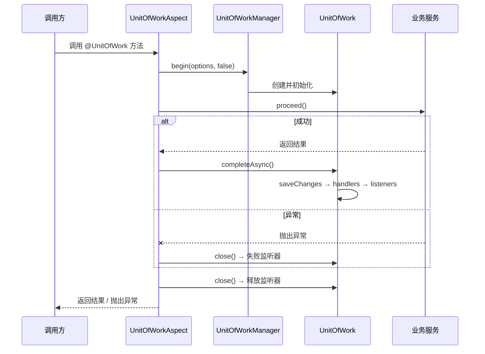

# Unit of Work 模块

轻量级异步工作单元抽象，用于在单次原子操作中协调事务资源（数据库、消息代理等）。灵感来自 .NET `Euonia.Uow` 模块。

---

## 架构

```
UnitOfWorkManager
        │
        ├── begin(options, requiresNew)
        │       │
        │       ▼
        │   ┌─────────────────────┐
        │   │    UnitOfWork        │
        │   │  (实现              │
        │   │   AutoCloseable)    │
        │   └────────┬────────────┘
        │            │
        │            ├── contexts: Map<String, UnitOfWorkContext>
        │            │       ├── "db"     → JdbcTransactionContext
        │            │       ├── "mq"     → MessageQueueContext
        │            │       └── "cache"  → CacheContext
        │            │
        │            ├── listeners
        │            │       ├── completedListeners
        │            │       ├── failedListeners
        │            │       └── disposedListeners
        │            │
        │            └── handlers
        │                    └── completedHandlers（异步前置完成回调）
        │
        └── getCurrent() → UnitOfWorkAccessor (ThreadLocal)
```

## 核心概念

| 类 / 接口 | 说明 |
|-----------|------|
| `UnitOfWork` | 协调上下文、监听器和生命周期（保存 → 完成 → 释放） |
| `UnitOfWorkManager` | 入口 — 创建工作单元，通过 `ThreadLocal` 管理环境作用域 |
| `UnitOfWorkContext` | 事务资源接口（保存、提交、回滚、关闭） |
| `ChildUnitOfWork` | 嵌套时无需 `requiresNew`，代理到父级 |
| `UnitOfWorkAccessor` | `ThreadLocal` 持有当前环境工作单元 |
| `UnitOfWorkOptions` | 事务标志、隔离级别、超时 |
| `UnitOfWorkEnabled` | 标记接口，用于自动拦截 |
| `@UnitOfWork` | 注解，用于声明式工作单元边界 |
| `UnitOfWorkHelper` | 静态工具类，用于检查注解 |

## 生命周期

```
initialize(options)
        │
        ▼
   [添加上下文 & 业务逻辑]
        │
        ├── completeAsync()
        │       │
        │       ├── saveChangesAsync()  ← 刷新所有上下文
        │       ├── invokeCompletedHandlers()
        │       └── notifyCompleted()   ← 触发完成监听器
        │
        └── close()  (AutoCloseable / try-with-resources)
                │
                ├── 关闭所有上下文
                ├── notifyFailed() 如果未完成
                └── notifyDisposed()
```

## 快速开始

### 编程式 API

```java
UnitOfWorkManager manager = new UnitOfWorkManager();

try (UnitOfWork uow = manager.begin(new UnitOfWorkOptions(true), false)) {
    uow.addContext("db", new JdbcTransactionContext(connection));

    uow.addCompletedListener(event ->
        log.info("工作单元 {} 已完成", event.getUnitOfWork().getId()));

    uow.addFailedListener(event ->
        log.error("工作单元执行失败", event.getException()));

    // ... 业务逻辑 ...

    uow.completeAsync().toCompletableFuture().join();
}
```

### 注解驱动（配合 AOP）

在服务类或方法上添加 `@UnitOfWork` 注解：

```java
import com.euonia.uow.annotation.UnitOfWork;

@UnitOfWork
public class OrderService implements UnitOfWorkEnabled {

    public void placeOrder(Order order) {
        // 自动包装在工作单元中
    }

    @UnitOfWork(disabled = true)
    public List<Order> findOrders() {
        // 只读 — 无需工作单元
    }
}
```

### Spring Boot 集成

添加 `spring` 模块依赖：

```xml
<dependency>
    <groupId>com.euonia</groupId>
    <artifactId>spring</artifactId>
    <version>${euonia.version}</version>
</dependency>
```

自动配置（`UnitOfWorkAutoConfiguration`）会注册以下 Bean：
- `UnitOfWorkAccessor` — 线程局部持有者
- `UnitOfWorkManager` — 创建工作单元的入口
- `UnitOfWorkAspect` — AOP 切面，拦截 `@UnitOfWork` 注解的方法

**切面工作原理：**



**服务示例：**

```java
@Service
@UnitOfWork
public class OrderService {

    private final JdbcTemplate jdbc;
    private final RabbitTemplate rabbit;

    public OrderService(JdbcTemplate jdbc, RabbitTemplate rabbit) {
        this.jdbc = jdbc;
        this.rabbit = rabbit;
    }

    public void placeOrder(Order order) {
        // 数据库写入和消息发布在同一工作单元中
        jdbc.update("INSERT INTO orders ...");
        rabbit.convertAndSend("order.exchange", "placed", order);
        // 成功：两者一起提交
        // 失败：两者一起回滚
    }
}
```

**注册事务上下文：**

通过生命周期监听器自动注册上下文：

```java
@Configuration
public class UowContextConfig {

    @Bean
    public UnitOfWorkManager unitOfWorkManager(
            UnitOfWorkAccessor accessor,
            DataSource dataSource,
            ConnectionFactory connectionFactory) {

        UnitOfWorkManager manager = new UnitOfWorkManager(accessor, new UnitOfWorkOptions(true));

        // 注册全局监听器，在创建时添加上下文
        // （可通过 UnitOfWork.addDisposedListener 方式，
        //   或继承 UnitOfWorkManager 覆写 begin() 方法）
        return manager;
    }
}
```

在每个工作单元中编程式注册上下文：

```java
@Autowired
private UnitOfWorkAccessor accessor;

public void doSomething() {
    UnitOfWork uow = accessor.getCurrentUnitOfWork();
    uow.getOrAddContext("db", () -> new JdbcTransactionContext(dataSource.getConnection()));
    // ... 所有数据库操作共享此上下文 ...
}
```

**嵌套工作单元：**

```java
@Service
public class OrderFacade {

    @Autowired
    private UnitOfWorkManager manager;

    @UnitOfWork
    public void checkout(Order order) {
        // 外层工作单元自动开始
        paymentService.charge(order);    // 参与外层 UOW
        inventoryService.reserve(order); // 参与外层 UOW
    }
}

@Service
@UnitOfWork
public class PaymentService {
    // 方法自动加入环境工作单元
    // 除非使用 .begin(..., true) 开启新事务
}
```

### 自定义事务上下文

```java
public class JdbcTransactionContext implements UnitOfWorkContext {
    private final Connection connection;

    public JdbcTransactionContext(Connection connection) {
        this.connection = connection;
    }

    @Override
    public CompletionStage<Void> saveChangesAsync() {
        return CompletableFuture.runAsync(() -> {
            // 刷新待执行语句
        });
    }

    @Override
    public CompletionStage<Void> commitAsync() {
        return CompletableFuture.runAsync(() -> connection.commit());
    }

    @Override
    public CompletionStage<Void> rollbackAsync() {
        return CompletableFuture.runAsync(() -> connection.rollback());
    }

    @Override
    public void close() {
        try { connection.close(); } catch (SQLException ignored) { }
    }
}
```

## 事件

| 事件类 | 触发时机 |
|--------|----------|
| `UnitOfWorkEvent` | 成功完成时和释放时 |
| `UnitOfWorkFailure` | 失败时（异常或显式回滚） |

## 隔离级别

| 级别 | JDBC 常量 |
|------|----------|
| `UNSPECIFIED` | `TRANSACTION_NONE` |
| `READ_UNCOMMITTED` | `TRANSACTION_READ_UNCOMMITTED` |
| `READ_COMMITTED` | `TRANSACTION_READ_COMMITTED` |
| `REPEATABLE_READ` | `TRANSACTION_REPEATABLE_READ` |
| `SERIALIZABLE` | `TRANSACTION_SERIALIZABLE` |

## Maven

```xml
<!-- 核心工作单元抽象 -->
<dependency>
    <groupId>com.euonia</groupId>
    <artifactId>unit-of-work</artifactId>
    <version>${euonia.version}</version>
</dependency>

<!-- Spring Boot AOP 集成（自动配置 + 切面） -->
<dependency>
    <groupId>com.euonia</groupId>
    <artifactId>spring</artifactId>
    <version>${euonia.version}</version>
</dependency>
```
